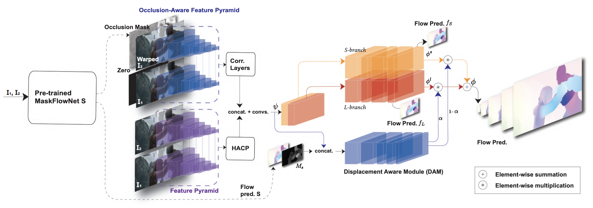

# MaskFlowNet_DAM
This is a MXNet based implementatoin for the paper "Incorporation of Displacement Masks for Enhancing Optical Flow Estimation" which submitted to CVPR 2021 with **submission ID 1736**. 

<center>
</img>
</center>


## Introduction
We propose MaskFlowNet-DAM, a learning based framework for differentiating and capturing motion features according to the scales of displacements in an optical flow map. MaskFlowNet-DAM employs a displacement aware architecture that splits the pipeline of optical flow estimation according to the flow magnitude.  Such a splitted pipeline architecture allows different scales of motions to be handled by different branches, enabling the optical flow of different scales to be constructed more precisely at object boundaries.


Please note this code is inherited and modified from the [MaskFlowNet official code](https://github.com/microsoft/MaskFlownet).

## Prepare Dataset & Setup Configurations 
Please download the dataset and setup the corresponding paths.

| Dataset | File need to be modified |
|:----:|:----:|
| [FlyingChairs](https://lmb.informatik.uni-freiburg.de/resources/datasets/FlyingChairs.en.html) | [main.py](./main.py)|
| [FlyingThings3D - subset](https://lmb.informatik.uni-freiburg.de/resources/datasets/SceneFlowDatasets.en.html) | [things3d.py](./reader/things3d.py) | 
| [Sintel](http://sintel.is.tue.mpg.de/downloads) | [sintel.py](./reader/sintel.py) |
| [KITTI 2012](http://www.cvlibs.net/datasets/kitti/eval_stereo_flow.php?benchmark=flow) & [KITTI 2015](http://www.cvlibs.net/datasets/kitti/eval_scene_flow.php?benchmark=flow) | [kitti.py](./reader/kitti.py) 
| [HD1K](http://hci-benchmark.iwr.uni-heidelberg.de/) | [hd1k.py](./reader/hd1k) |

## Training 
To train the MaskFlowNet_DAM based on MaskFlowNet_S, run the following script:

* FlyingChairs
```bash
# With distance-based weighting factor
python main.py MaskFlownet_DAM.yaml -c abbSep15 -g 0,1,2,3 --clear_steps --weighted

# Without distance-based weighting factor
python main.py MaskFlownet_DAM.yaml -c abbSep15 -g 0,1,2,3 --clear_steps
```

* FlyingThings3D
```bash
# With distance-based weighting factor
python main.py MaskFlownet_DAM_ft.yaml --dataset_cfg things3d.yaml -c CKPT_FROM_CHAIRS \ 
               -g 0,1,2,3 --clear_steps --weighted

# Without distance-based weighting factor
python main.py MaskFlownet_DAM_ft.yaml --dataset_cfg things3d.yaml -c CKPT_FROM_CHAIRS \
               -g 0,1,2,3 --clear_steps
```

* Sintel
```bash
# With distance-based weighting factor
python main.py MaskFlownet_DAM_sintel.yaml --dataset_cfg sintel_kitti2015_hd1k.yaml \
               -c CKPT_FROM_THINGS -g 0,1,2,3 --clear_steps --weighted

# Without distance-based weighting factor
python main.py MaskFlownet_DAM_sintel.yaml --dataset_cfg sintel_kitti2015_hd1k.yaml \
               -c CKPT_FROM_THINGS -g 0,1,2,3 --clear_steps 
```

## Evaluation
We provide the pre-trained model of MaskFlownet_DAM trained on `FlyingChairs (C)` + `FlyingThings3D (T)`.

Please download the pre-trained model and put in `./weights/.`

| Model  | Clean |   Final |
| :----: | :-----: | :----: |
| [C_T_no_weighted](https://drive.google.com/file/d/1ou5DRH6ug_xKi2wZWQ81reY0GBR62qyv/view?usp=sharing) | 2.07 |  3.52 |
| [C_T_weighted](https://drive.google.com/file/d/1EdHz4gRnloU8fQ_JZ4NVrraBShijWWrt/view?usp=sharing)    | 2.10 |  3.48 | 

To evaluate on the provided pre-trained model, run the commands below,
* Example Commands
```
python evaluate.py -c C_T_no_weighted -g 0,1,2,3 -d sintel --valid 
```
```
python evaluate.py -c C_T_weighted -g 0,1,2,3 -d sintel --weighted --valid 
```

List of arguments
```
--dataset (or -d)     - To select dataset for evaluation (option: kitti or sintel)
--weighted            - Use distance-based weighting factor or not
```
